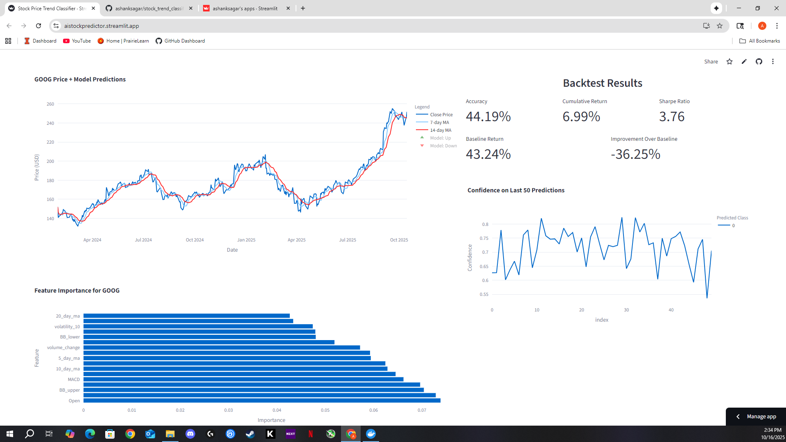

# ML Stock Trend Classifier

An interactive **machine learning web app** that predicts next-day stock price direction using technical indicators and historical data.  
Built with **Python, XGBoost, and Streamlit**, this project combines financial analytics, feature engineering, and automated model retraining to demonstrate data-driven market forecasting.

**Live Demo:** [aistockpredictor.streamlit.app](https://aistockpredictor.streamlit.app/)

  
  

---

## Overview

The app allows users to visualize stock performance, technical indicators, and model predictions in real time.  
It supports multiple tickers (AAPL, TSLA, SPY, etc.) and compares the model’s backtested performance against buy-and-hold benchmarks.

---

## Key Features

- **Machine Learning Pipeline**
  - Trains XGBoost classifiers on engineered features such as RSI, MACD, moving averages, and volatility bands.  
  - Uses Optuna for hyperparameter tuning to maximize predictive accuracy and risk-adjusted return.

- **Dynamic Visualization**
  - Interactive Streamlit dashboard with stock charts, trend overlays, and prediction markers.  
  - Real-time metric updates (accuracy, Sharpe ratio, cumulative return).

- **Backtesting Engine**
  - Custom Python backtester simulates trading with transaction costs and confidence thresholds.  
  - Evaluates risk-adjusted performance vs. baseline strategies.

- **Automated Daily Retraining (GitHub Actions)**
  - Integrated **GitHub Actions workflow** fetches the latest market data each morning.  
  - Automatically updates datasets, retrains the XGBoost models, and redeploys the latest version of the app.  
  - Ensures predictions remain accurate and reflect current market conditions without manual intervention.

- **Multi-Ticker Analysis**
  - Tests across 50 S&P 500 stocks.  
  - 56% outperform buy-and-hold; top Sharpe ratio **4.14** and cumulative return **65.9%** (TSLA).

- **Deployment-Ready**
  - Packaged and deployed via Streamlit Cloud for public access.  
  - Lightweight, reproducible setup 

---

## Architecture
- **Data Layer:** Yahoo Finance / yfinance API for historical stock data  
- **Model Layer:** XGBoost for classification  
- **Evaluation Layer:** Sharpe ratio, cumulative return, accuracy  
- **App Layer:** Streamlit UI with Matplotlib and Plotly charts  
- **Automation Layer:** GitHub Actions for updated stock data and daily model retraining  

